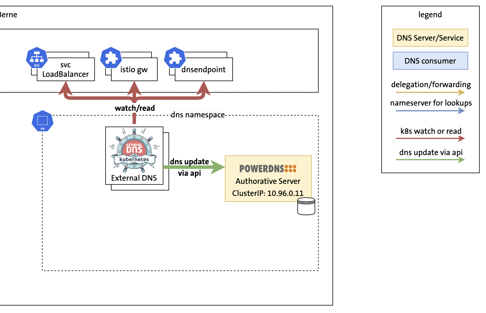

# Demo 1: ExternalDNS & PowerDNS Single Cluster

[Demo 1 recording](https://youtu.be/CR8R3cOCLXc?si=rtUyv1LNGAyV1dpe&t=755)



## Demo Preparation

Before the demo, execute make demo1 in the parent folder.


### 1. Show pods

```
kubectl get pods -n dns
```

### 2. Show svc.yaml file

```
cat svc.yaml
```

### 3. Apply svc.yaml

```
kubectl apply -f svc.yaml
```

### 4. Check ExternalDNS logs

```
kubectl -n dns logs deploy/external-dns-0 --tail 10
```

### 5. Dig PowerDNS for nginx record

```
kubectl exec -it dnsutils -- dig +noall +answer nginx.5gc.3gppnetwork.org @10.96.0.12
```

### 6. Show dns-endpoint-cr.yaml

```
cat dns-endpoint-cr.yaml
```

### 7. Apply dns-endpoint-cr.yaml
```
kubectl apply -f dns-endpoint-cr.yaml
```

### 4. Check ExternalDNS logs

```
kubectl -n dns logs deploy/external-dns-0 --tail 10
```

### 8. Dig PowerDNS for endpoint1 record
```
kubectl exec -it dnsutils -- dig +noall +answer endpoint1.5gc.3gppnetwork.org @10.96.0.12
```
