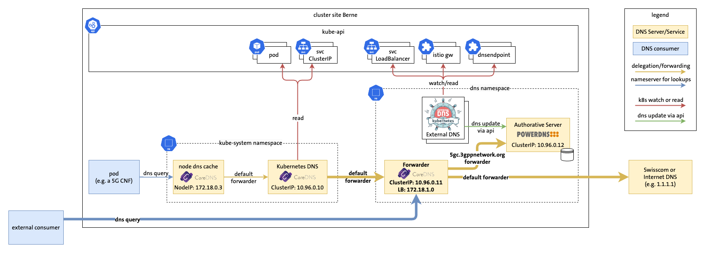

# Demo 2: Forwarding

[Demo 2 recording](https://youtu.be/CR8R3cOCLXc?si=XhjIBz-DK8mpXbXi&t=953)



## Demo Preparation

Before the demo, execute the prepare-demo2.sh script in the parent folder.


### List pods

```
kubectl get pods -n dns
```

### Show new coredns configmap in dns namespace

```
kubectl describe cm/coredns -n dns
```

### Show coredns services in dns namespace

```
kubectl get svc -n dns
```

### Show kube-system coredns configmap

```
kubectl describe cm/coredns -n kube-system
```

### Dig nginx using default dns

```
kubectl exec -it dnsutils -- dig +noall +answer nginx.5gc.3gppnetwork.org
```

### Dig endpoint1 using default dns

```
kubectl exec -it dnsutils -- dig +noall +answer endpoint1.5gc.3gppnetwork.org
```

### Dig nginx service from local machine using coredns loadbalancer ip

```
colima exec dig +noall +answer nginx.5gc.3gppnetwork.org @172.18.1.0
```
