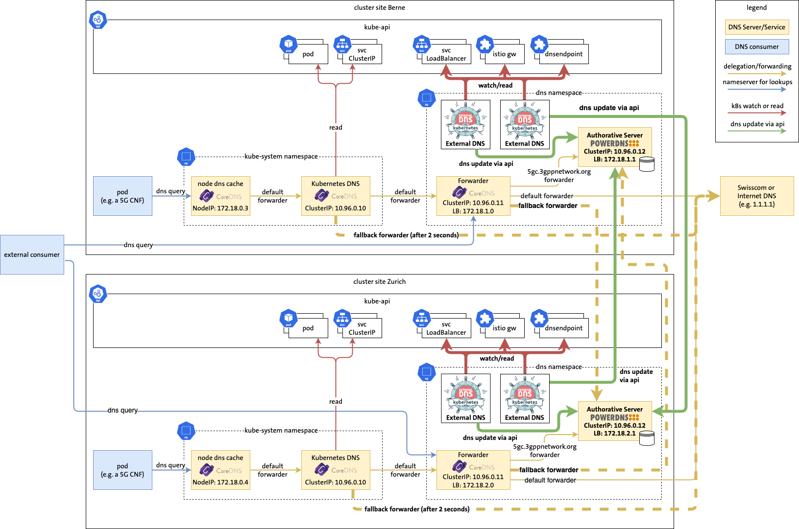

# Demo 3 Multi-cluster DNS



## Demo Preparation

Before the demo, execute make demo3 in the parent folder.


### Show logs of externalDNS-zurich deployment
```
kubectl --context kind-berne -n dns logs deploy/external-dns-zurich
```

### Lookup nginx in zurich
```
kubectl --context kind-zurich exec -it dnsutils -- dig +noall +answer  nginx.5gc.3gppnetwork.org
```

### Lookup endpoint1 in zurich
```
kubectl --context kind-zurich exec -it dnsutils -- dig +noall +answer  endpoint1.5gc.3gppnetwork.org
```

### Cat dns-endpoint-cr-2.yaml
```
cat dns-endpoint-cr-2.yaml
```


### Apply endpoint-cr-2 to zurich
```
kubectl --context kind-zurich apply -f dns-endpoint-cr-2.yaml
```

### Show logs of externalDNS-zurich deployment in zurich
```
kubectl --context kind-zurich -n dns logs deploy/external-dns-zurich
```

### Show logs of externalDNS-berne deployment in zurich
```
kubectl --context kind-zurich -n dns logs deploy/external-dns-berne
```

### Lookup endpoint2 in cluster berne
```
kubectl --context kind-berne exec -it dnsutils -- dig +noall +answer  endpoint2.5gc.3gppnetwork.org
```

### Scale down powerDNS deployment to 0 in berne
```
kubectl --context kind-berne -n dns scale deployment pdns-deployment --replicas=0
```

### Lookup nginx in berne
```
kubectl --context kind-berne exec -it dnsutils -- dig +noall +answer nginx.5gc.3gppnetwork.org
```

### Apply endpoint3 to berne
```
kubectl --context kind-berne apply -f dns-endpoint-cr-3.yaml
```

### Lookup endpoint3 in zurich
```
kubectl --context kind-zurich exec -it dnsutils -- dig +noall +answer endpoint3.5gc.3gppnetwork.org
```

### Lookup endpoint3 in berne
```
kubectl --context kind-berne exec -it dnsutils -- dig +noall +answer endpoint3.5gc.3gppnetwork.org
```

### Scale down coredns forwarder deployment to 0 in cluster berne
```
kubectl --context kind-berne -n dns scale deployment forwarder-coredns --replicas=0
```

### Lookup endpoint3 in berne
```
kubectl --context kind-berne exec -it dnsutils -- dig +noall +answer endpoint3.5gc.3gppnetwork.org
```

### Scale down coredns forwarder deployment to 0 in zurich
```
kubectl --context kind-zurich -n dns scale deployment forwarder-coredns --replicas=0
```

### Lookup google.com in berne
```
kubectl --context kind-berne exec -it dnsutils -- dig +noall +answer google.com
```

### Scale up coredns forwarder deployment to 1 in zurich
```
kubectl --context kind-zurich -n dns scale deployment forwarder-coredns --replicas=1
```

