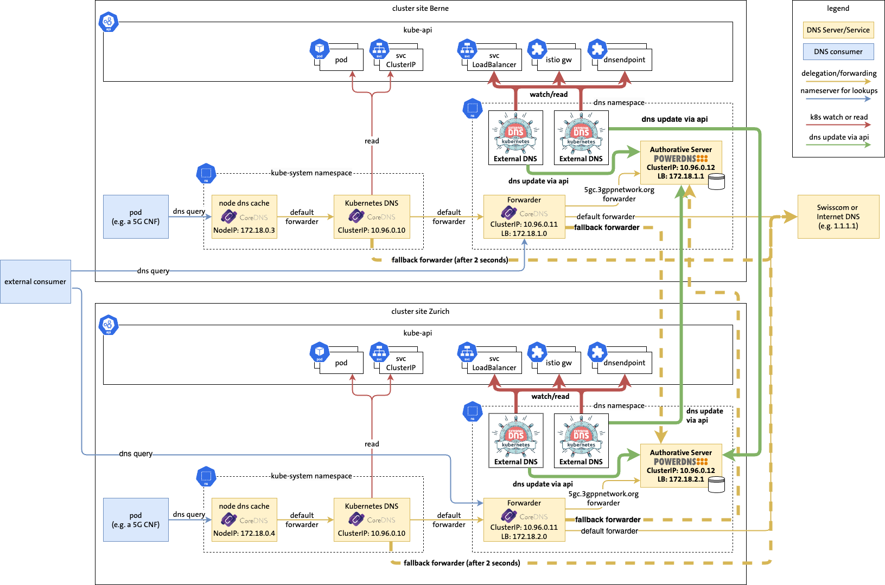

# Demo 3 Multi-cluster DNS

[Demo 3 recording](https://youtu.be/CR8R3cOCLXc?si=gcoYWjIChXGIhiRW&t=1232)



## Demo Preparation

Before the demo, execute `make demo3` or `make demo3-fresh` in the parent folder.

## Interactive Diagram

```bash
uv run --directory prototypes/dns/3-demo-multi-cluster-dns/dashboard python dns_dashboard.py
```

## Demo Creation When Everything Is Up and Running

```bash
# Lookup endpoint1 to confirm it doesn't yet exist
echo "berne:"  && kubectl --context kind-berne exec -it dnsutils -- dig +noall +answer  endpoint1.5gc.3gppnetwork.org
echo "zurich:" && kubectl --context kind-zurich exec -it dnsutils -- dig +noall +answer  endpoint1.5gc.3gppnetwork.org

# apply DNS Resource "endpoint1.5gc.3gppnetwork.org" to Zurich cluster
cat dns-endpoint-cr-1.yaml
kubectl --context kind-zurich apply -f dns-endpoint-cr-1.yaml

# Show logs of ExternalDNS deployments in zurich
echo "berne:"  && {kubectl --context kind-zurich -n dns logs deploy/external-dns-zurich | tail}
echo "zurich:" && {kubectl --context kind-zurich -n dns logs deploy/external-dns-berne | tail}

# Lookup endpoint1
echo "berne:"  && kubectl --context kind-berne exec -it dnsutils -- dig +noall +answer  endpoint1.5gc.3gppnetwork.org
echo "zurich:" && kubectl --context kind-zurich exec -it dnsutils -- dig +noall +answer  endpoint1.5gc.3gppnetwork.org
```

## Demo Creation When PowerDNS in One Site Is Gone

```bash
# Scale down PowerDNS deployment to 0 in berne
kubectl --context kind-berne -n dns scale deployment pdns-deployment --replicas=0

# Show deployments
echo "berne:"  && kubectl --context kind-berne -n dns get deploy
echo "zurich:" && kubectl --context kind-zurich -n dns get deploy

# Lookup endpoint2 to confirm it doesn't yet exist
echo "berne:"  && kubectl --context kind-zurich exec -it dnsutils -- dig +noall +answer endpoint2.5gc.3gppnetwork.org
echo "zurich:" && kubectl --context kind-berne exec -it dnsutils -- dig +noall +answer endpoint2.5gc.3gppnetwork.org

# apply DNS Resource "endpoint2.5gc.3gppnetwork.org" to Berne cluster
cat dns-endpoint-cr-2.yaml
kubectl --context kind-berne apply -f dns-endpoint-cr-2.yaml

# Lookup endpoint2
echo "berne:"  && kubectl --context kind-zurich exec -it dnsutils -- dig +noall +answer endpoint2.5gc.3gppnetwork.org
echo "zurich:" && kubectl --context kind-berne exec -it dnsutils -- dig +noall +answer endpoint2.5gc.3gppnetwork.org
# both succeed because cross cluster forwarding.
```

## Demo Creation When PowerDNS + CoreDNS Forwarder in One Site Is Gone

```bash
# scale down forwarder in berne
kubectl --context kind-berne -n dns scale deployment forwarder-coredns --replicas=0

# Show deployments
echo "berne:"  && kubectl --context kind-berne -n dns get deploy
echo "zurich:" && kubectl --context kind-zurich -n dns get deploy

# Lookup endpoint3 to confirm it doesn't yet exist
echo "berne:"  && kubectl --context kind-berne exec -it dnsutils -- dig +noall +answer endpoint3.5gc.3gppnetwork.org
echo "zurich:" && kubectl --context kind-zurich exec -it dnsutils -- dig +noall +answer endpoint3.5gc.3gppnetwork.org

# apply DNS Resource "endpoint3.5gc.3gppnetwork.org" to Berne cluster
cat dns-endpoint-cr-3.yaml
kubectl --context kind-berne apply -f dns-endpoint-cr-3.yaml

# Lookup endpoint3
echo "berne:"  && kubectl --context kind-berne exec -it dnsutils -- dig +noall +answer endpoint3.5gc.3gppnetwork.org
echo "zurich:" && kubectl --context kind-zurich exec -it dnsutils -- dig +noall +answer endpoint3.5gc.3gppnetwork.org
```

## Break It by Scaling Down the Fallback CoreDNS Forwarder on the Other Site

```bash
# scale down zurich forwarder
kubectl --context kind-zurich -n dns scale deployment forwarder-coredns --replicas=0

# Show deployments
echo "berne:"  && kubectl --context kind-berne -n dns get deploy
echo "zurich:" && kubectl --context kind-zurich -n dns get deploy

# Lookup endpoint3
echo "berne:"  && kubectl --context kind-berne exec -it dnsutils -- dig +noall +answer endpoint3.5gc.3gppnetwork.org
echo "zurich:" && kubectl --context kind-zurich exec -it dnsutils -- dig +noall +answer endpoint3.5gc.3gppnetwork.org

# Lookup example.com hosted on a public DNS
echo "berne:"  && kubectl --context kind-berne exec -it dnsutils -- dig +noall +answer example.com
echo "zurich:" && kubectl --context kind-berne exec -it dnsutils -- dig +noall +answer example.com
```

## Restore

### Restore CoreDNS Forwarder In Second Site

```bash
# scale restore forwarder in zurich
kubectl --context kind-zurich -n dns scale deployment forwarder-coredns --replicas=1

# Show deployments
echo "berne:"  && kubectl --context kind-berne -n dns get deploy
echo "zurich:" && kubectl --context kind-zurich -n dns get deploy

# check if lookup works
echo "berne:"  && kubectl --context kind-berne exec -it dnsutils -- dig +noall +answer endpoint3.5gc.3gppnetwork.org
echo "zurich:" && kubectl --context kind-zurich exec -it dnsutils -- dig +noall +answer endpoint3.5gc.3gppnetwork.org
```

### Restore Everything

```bash
# scale back all deployments and delete dns-endpoint
kubectl --context kind-zurich -n dns scale deployment forwarder-coredns --replicas=1
kubectl --context kind-berne -n dns scale deployment pdns-deployment --replicas=1
kubectl --context kind-berne -n dns scale deployment forwarder-coredns --replicas=1
kubectl --context kind-zurich delete -f dns-endpoint-cr-1.yaml
kubectl --context kind-berne delete -f dns-endpoint-cr-2.yaml
kubectl --context kind-berne delete -f dns-endpoint-cr-3.yaml
```
